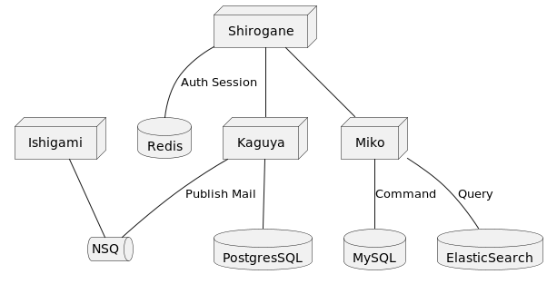

# Wattpad Microservice

Repository of learning outcomes on microservices with case studies of Wattpad using Golang.



| Services                     | Description                     |
|------------------------------|---------------------------------|
| [`Shirogane`](src/shirogane) | API Gateway                     |
| [`Kaguya`](src/kaguya)       | User and authentication service |
| [`Ishigami`](src/ishigami)   | Mail service                    |
| `Miko`                       | Story service                   |

I manage the protobuf of each GRPC service in a folder with the name [hayasaka](hayasaka) so that it is standardized.

## Getting Started

### Installation

Use docker to run the program with the following command:

```bash
$ docker-compose up -d
```

Connect the url on the api gateway, to see the url of the api gateway, use the following command:

```bash
$ docker container inspect shirogane-service
```

### API Documentation

I'm using Postman to document an existing API. Please import the following [file](Wattpad.postman_collection.json) in
your Postman.

### Mail monitoring

Kami menggunakan [mailhog](https://github.com/mailhog/MailHog) sebagai server SMTP dan penerima email. Untuk melihat
email yang dikirim, silahkan buka laman berikut pada browser :

Open [http://localhost:8025](http://localhost:8025)

### Todo

- [x] User and authentication
- [x] Send mail
- [ ] Story, chapter, genre, and tag